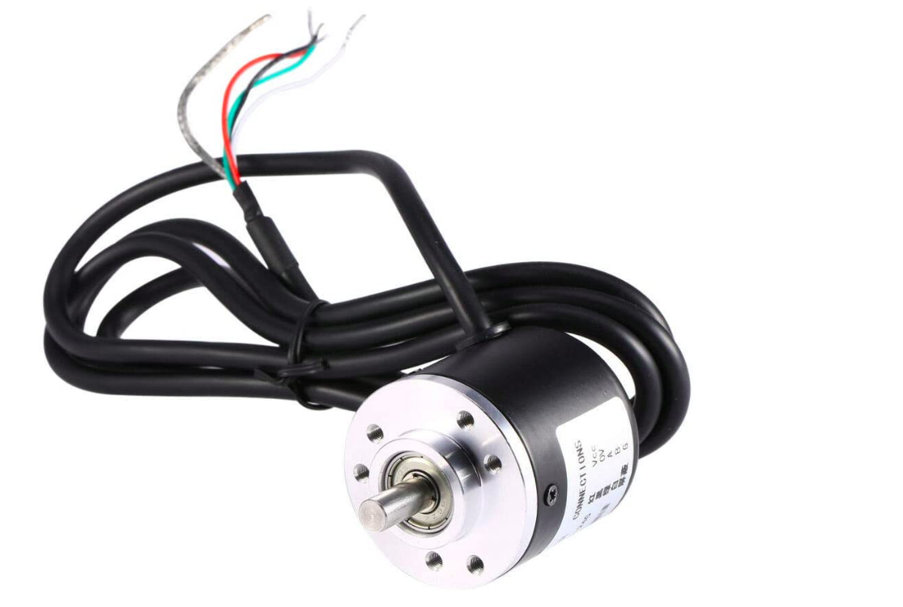
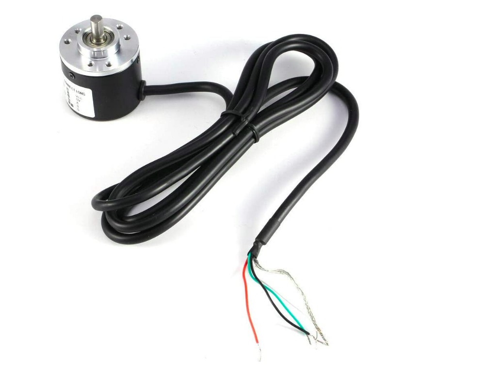

# EnocderTest

## Arduino code for LPD3806-360BM-G5-24C Incremental Rotary Encoder
### *This Code uses the arduino's internal pull-up resistors*

## Pinout:

- RED WIRE - **5V**
- BLACK WIRE - **GND**
- GREEN WIRE - **CHANNEL A**
- WHITE WIRE - **CHANNEL B**
- SHIELD WIRE - **GND**

## Images of the Encoder 

